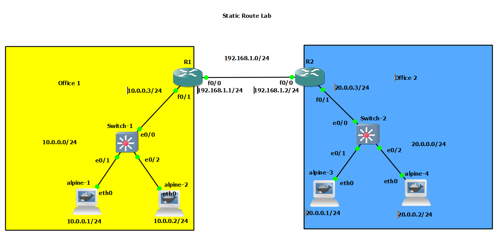

# Static Routing

Topology



# Network Interface Configuration

At Alpine 1 [10.0.0.1]

```bash
auto eth0
iface eth0 inet static
	address 10.0.0.1
	netmask 255.255.255.0
	gateway 10.0.0.3
```

At Alpine 2 [10.0.0.2]

```bash
auto eth0
iface eth0 inet static
	address 10.0.0.2
	netmask 255.255.255.0
	gateway 10.0.0.3
```

At Alpine 3 [20.0.0.1]

```bash
auto eth0
iface eth0 inet static
	address 20.0.0.1
	netmask 255.255.255.0
	gateway 20.0.0.3
```

At Alpine 3 [20.0.0.2]

```bash
auto eth0
iface eth0 inet static
	address 20.0.0.2
	netmask 255.255.255.0
	gateway 20.0.0.3
```

# Configure IP in Router 1 and Router 2

At Router 1

```bash
R1(config)#inter
R1(config)#interface fas
R1(config)#interface fastEthernet 0/1
R1(config-if)#ip add
R1(config-if)#ip address 10.0.0.3 255.255.255.0
R1(config-if)#ip inter
R1(config-if)#no shutdown
R1(config-if)#
*Mar  1 00:05:39.587: %LINK-3-UPDOWN: Interface FastEthernet0/1, changed state to up
*Mar  1 00:05:40.587: %LINEPROTO-5-UPDOWN: Line protocol on Interface FastEthernet0/1, changed state to up

R1(config)#interface fast
R1(config)#interface fastEthernet 0/0
R1(config-if)#ip add
R1(config-if)#ip address 192.168.1.1 255.255.255.0 
R1(config-if)#no shutdown

R1(config-if)#do sh ip int br
Interface                  IP-Address      OK? Method Status                Protocol
FastEthernet0/0            192.168.1.1     YES manual up                    up      
Serial0/0                  unassigned      YES unset  administratively down down    
FastEthernet0/1            10.0.0.3        YES manual up                    up
```

At Router 2

```bash
R2(config)#interface fastEthernet 0/1
R2(config-if)#ip add
R2(config-if)#ip address 20.0.0.3 255.255.255.0 
R2(config-if)#no shutdown
R2(config-if)#do interfa
*Mar  1 00:07:32.579: %LINK-3-UPDOWN: Interface FastEthernet0/1, changed state to up
*Mar  1 00:07:33.579: %LINEPROTO-5-UPDOWN: Line protocol on Interface FastEthernet0/1, changed state to up
R2(config-if)#do interface fas
% Ambiguous command:  "do interface fas"
R2(config-if)#do interface fastEthernet 0/0
interface fastEthernet 0/0
 ^
% Invalid input detected at '^' marker.

R2(config-if)#exit
R2(config)#inter
R2(config)#interface fast
R2(config)#interface fastEthernet 0/0
R2(config-if)#ip add
R2(config-if)#ip address 192.168.1.2 255.255.255.0 
R2(config-if)#no shutdown 
R2(config-if)#do sh ip int br
Interface                  IP-Address      OK? Method Status                Protocol
FastEthernet0/0            192.168.1.2     YES manual up                    up      
Serial0/0                  unassigned      YES unset  administratively down down    
FastEthernet0/1            20.0.0.3        YES manual up                    up      
```

# Checking Route Table

At Router 2

```bash
R2#show ip 
*Mar  1 00:08:38.495: %SYS-5-CONFIG_I: Configured from console by console
R2#show ip route
Codes: C - connected, S - static, R - RIP, M - mobile, B - BGP
       D - EIGRP, EX - EIGRP external, O - OSPF, IA - OSPF inter area 
       N1 - OSPF NSSA external type 1, N2 - OSPF NSSA external type 2
       E1 - OSPF external type 1, E2 - OSPF external type 2
       i - IS-IS, su - IS-IS summary, L1 - IS-IS level-1, L2 - IS-IS level-2
       ia - IS-IS inter area, * - candidate default, U - per-user static route
       o - ODR, P - periodic downloaded static route

Gateway of last resort is not set

     20.0.0.0/24 is subnetted, 1 subnets
C       20.0.0.0 is directly connected, FastEthernet0/1
C    192.168.1.0/24 is directly connected, FastEthernet0/0
```

At Router 1

```bash
R1(config-if)#do show ip route
Codes: C - connected, S - static, R - RIP, M - mobile, B - BGP
       D - EIGRP, EX - EIGRP external, O - OSPF, IA - OSPF inter area 
       N1 - OSPF NSSA external type 1, N2 - OSPF NSSA external type 2
       E1 - OSPF external type 1, E2 - OSPF external type 2
       i - IS-IS, su - IS-IS summary, L1 - IS-IS level-1, L2 - IS-IS level-2
       ia - IS-IS inter area, * - candidate default, U - per-user static route
       o - ODR, P - periodic downloaded static route

Gateway of last resort is not set

     10.0.0.0/24 is subnetted, 1 subnets
C       10.0.0.0 is directly connected, FastEthernet0/1
C    192.168.1.0/24 is directly connected, FastEthernet0/0
```

# Configure the Static Route

At Router 1

```bash
R1(config)#ip route 20.0.0.0 255.255.255.0 192.168.1.2
R1(config)#do show ip route
Codes: C - connected, S - static, R - RIP, M - mobile, B - BGP
       D - EIGRP, EX - EIGRP external, O - OSPF, IA - OSPF inter area 
       N1 - OSPF NSSA external type 1, N2 - OSPF NSSA external type 2
       E1 - OSPF external type 1, E2 - OSPF external type 2
       i - IS-IS, su - IS-IS summary, L1 - IS-IS level-1, L2 - IS-IS level-2
       ia - IS-IS inter area, * - candidate default, U - per-user static route
       o - ODR, P - periodic downloaded static route

Gateway of last resort is not set

     20.0.0.0/24 is subnetted, 1 subnets
S       20.0.0.0 [1/0] via 192.168.1.2
     10.0.0.0/24 is subnetted, 1 subnets
C       10.0.0.0 is directly connected, FastEthernet0/1
C    192.168.1.0/24 is directly connected, FastEthernet0/0
```

At Router 2

```bash
R2(config)#ip route 10.0.0.0 255.255.255.0 192.168.1.1    
R2(config)#do sh ip route
Codes: C - connected, S - static, R - RIP, M - mobile, B - BGP
       D - EIGRP, EX - EIGRP external, O - OSPF, IA - OSPF inter area 
       N1 - OSPF NSSA external type 1, N2 - OSPF NSSA external type 2
       E1 - OSPF external type 1, E2 - OSPF external type 2
       i - IS-IS, su - IS-IS summary, L1 - IS-IS level-1, L2 - IS-IS level-2
       ia - IS-IS inter area, * - candidate default, U - per-user static route
       o - ODR, P - periodic downloaded static route

Gateway of last resort is not set

     20.0.0.0/24 is subnetted, 1 subnets
C       20.0.0.0 is directly connected, FastEthernet0/1
     10.0.0.0/24 is subnetted, 1 subnets
S       10.0.0.0 [1/0] via 192.168.1.1
C    192.168.1.0/24 is directly connected, FastEthernet0/0
```

# Network Connectivity Test

From alpine-1 [10.0.0.1]

```bash
/ # ping 20.0.0.1
PING 20.0.0.1 (20.0.0.1): 56 data bytes
64 bytes from 20.0.0.1: seq=2 ttl=62 time=20.888 ms
64 bytes from 20.0.0.1: seq=3 ttl=62 time=27.802 ms
64 bytes from 20.0.0.1: seq=4 ttl=62 time=24.249 ms
64 bytes from 20.0.0.1: seq=5 ttl=62 time=30.781 ms
64 bytes from 20.0.0.1: seq=6 ttl=62 time=37.833 ms
^C
--- 20.0.0.1 ping statistics ---
7 packets transmitted, 5 packets received, 28% packet loss
round-trip min/avg/max = 20.888/28.310/37.833 ms
/ # ping 20.0.0.2
PING 20.0.0.2 (20.0.0.2): 56 data bytes
64 bytes from 20.0.0.2: seq=1 ttl=62 time=35.044 ms
64 bytes from 20.0.0.2: seq=2 ttl=62 time=32.058 ms
64 bytes from 20.0.0.2: seq=3 ttl=62 time=38.846 ms
64 bytes from 20.0.0.2: seq=4 ttl=62 time=35.516 ms
^C
--- 20.0.0.2 ping statistics ---
5 packets transmitted, 4 packets received, 20% packet loss
round-trip min/avg/max = 32.058/35.366/38.846 ms
```

From alpine-2 [10.0.0.2]

```bash
/ # ping 20.0.0.1
PING 20.0.0.1 (20.0.0.1): 56 data bytes
64 bytes from 20.0.0.1: seq=0 ttl=62 time=48.491 ms
64 bytes from 20.0.0.1: seq=1 ttl=62 time=34.847 ms
64 bytes from 20.0.0.1: seq=2 ttl=62 time=31.285 ms
^C
--- 20.0.0.1 ping statistics ---
4 packets transmitted, 3 packets received, 25% packet loss
round-trip min/avg/max = 31.285/38.207/48.491 ms
/ # ping 20.0.0.2
PING 20.0.0.2 (20.0.0.2): 56 data bytes
64 bytes from 20.0.0.2: seq=0 ttl=62 time=36.495 ms
64 bytes from 20.0.0.2: seq=1 ttl=62 time=23.039 ms
^C
--- 20.0.0.2 ping statistics ---
2 packets transmitted, 2 packets received, 0% packet loss
round-trip min/avg/max = 23.039/29.767/36.495 ms
```

From alpine 3 [20.0.0.1]

```bash
/ # ping 10.0.0.1
PING 10.0.0.1 (10.0.0.1): 56 data bytes
64 bytes from 10.0.0.1: seq=0 ttl=62 time=40.778 ms
64 bytes from 10.0.0.1: seq=1 ttl=62 time=37.781 ms
64 bytes from 10.0.0.1: seq=2 ttl=62 time=35.120 ms
64 bytes from 10.0.0.1: seq=3 ttl=62 time=32.334 ms
^C
--- 10.0.0.1 ping statistics ---
4 packets transmitted, 4 packets received, 0% packet loss
round-trip min/avg/max = 32.334/36.503/40.778 ms
/ # ping 10.0.0.2 -c 4
PING 10.0.0.2 (10.0.0.2): 56 data bytes
64 bytes from 10.0.0.2: seq=0 ttl=62 time=25.144 ms
64 bytes from 10.0.0.2: seq=1 ttl=62 time=35.596 ms
64 bytes from 10.0.0.2: seq=2 ttl=62 time=32.314 ms
64 bytes from 10.0.0.2: seq=3 ttl=62 time=28.656 ms

--- 10.0.0.2 ping statistics ---
4 packets transmitted, 4 packets received, 0% packet loss
round-trip min/avg/max = 25.144/30.427/35.596 ms
```

From alpine 4 [20.0.0.2]

```bash
alpine-4 console is now available... Press RETURN to get started.
/ # ping 10.0.0.1 -c 4
PING 10.0.0.1 (10.0.0.1): 56 data bytes
64 bytes from 10.0.0.1: seq=0 ttl=62 time=30.511 ms
64 bytes from 10.0.0.1: seq=1 ttl=62 time=27.486 ms
64 bytes from 10.0.0.1: seq=2 ttl=62 time=34.797 ms
64 bytes from 10.0.0.1: seq=3 ttl=62 time=42.265 ms

--- 10.0.0.1 ping statistics ---
4 packets transmitted, 4 packets received, 0% packet loss
round-trip min/avg/max = 27.486/33.764/42.265 ms
/ # ping 10.0.0.2 -c 4
PING 10.0.0.2 (10.0.0.2): 56 data bytes
64 bytes from 10.0.0.2: seq=0 ttl=62 time=32.874 ms
64 bytes from 10.0.0.2: seq=1 ttl=62 time=40.225 ms
64 bytes from 10.0.0.2: seq=2 ttl=62 time=36.615 ms
64 bytes from 10.0.0.2: seq=3 ttl=62 time=33.383 ms

--- 10.0.0.2 ping statistics ---
4 packets transmitted, 4 packets received, 0% packet loss
round-trip min/avg/max = 32.874/35.774/40.225 ms
```